# TODOアプリ データフロー図

## システム全体のデータフロー

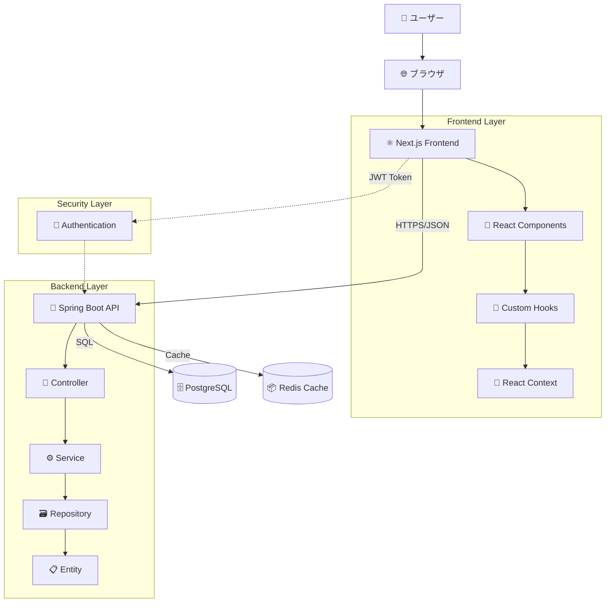

## ユーザーインタラクションフロー

### 1. 認証フロー

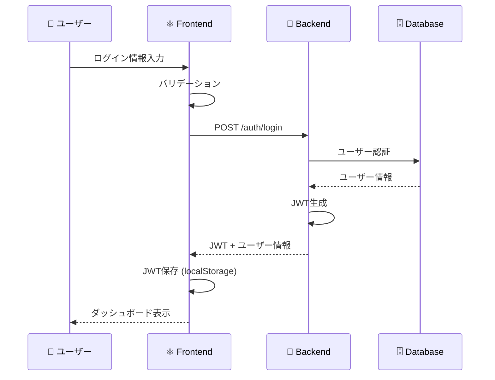

### 2. TODO CRUD フロー

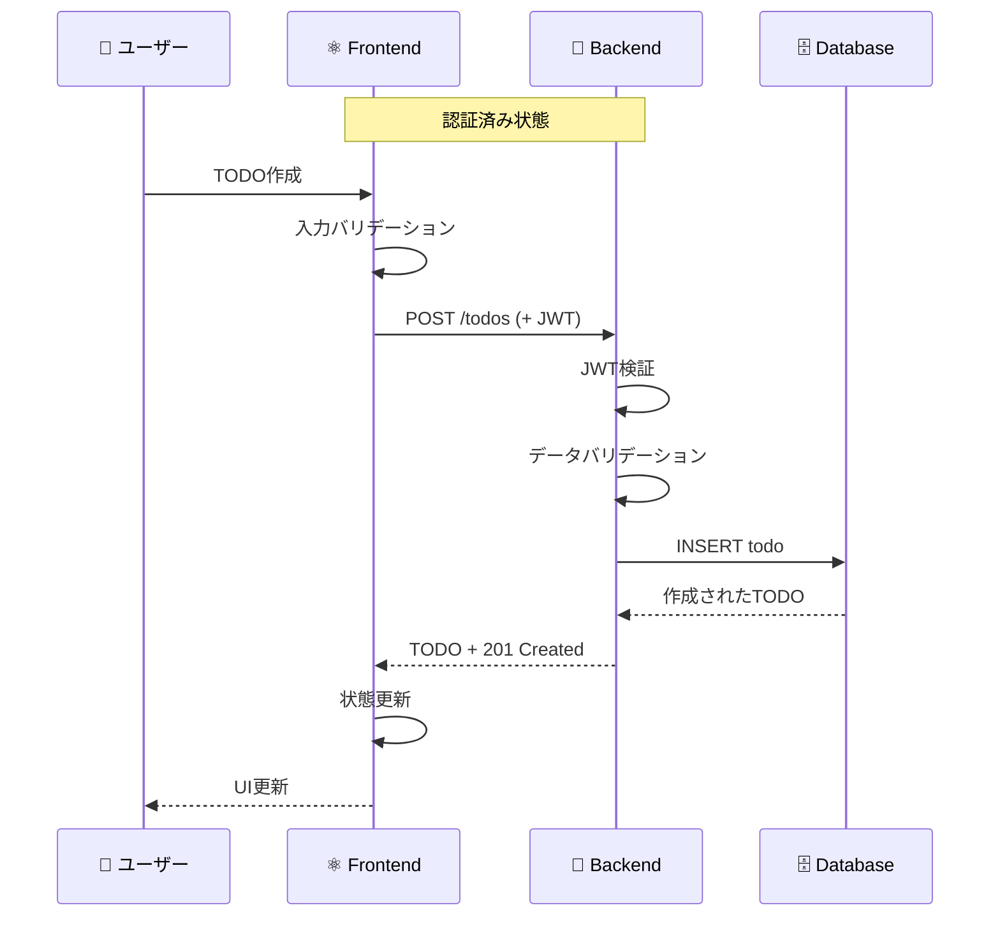

### 3. リアルタイム検索フロー

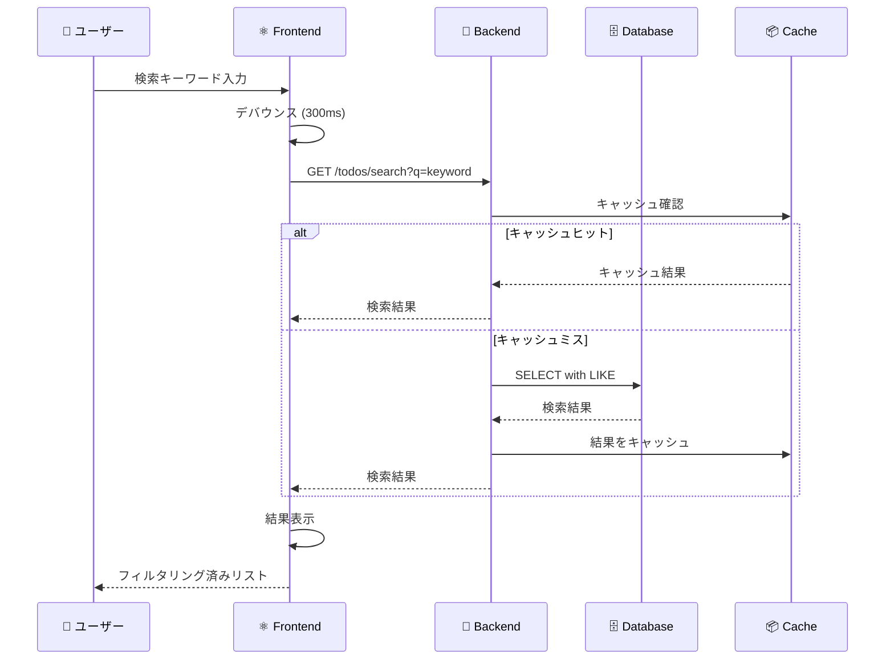

## データ処理パターン

### 1. 楽観的更新パターン

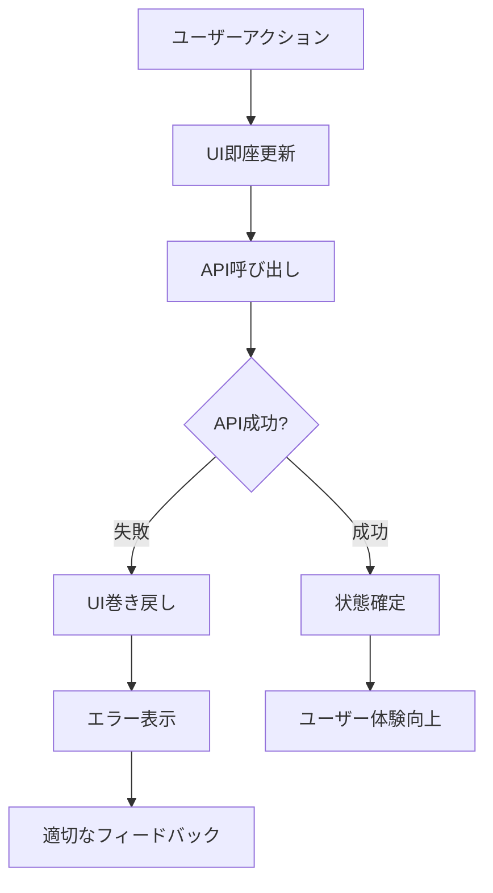

### 2. エラーハンドリングフロー

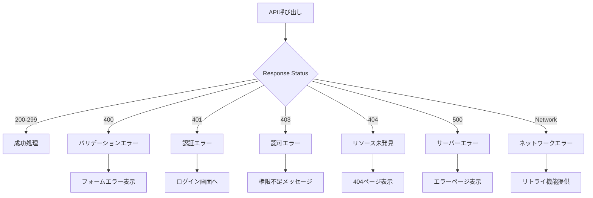

## 状態管理フロー

### Frontend状態管理

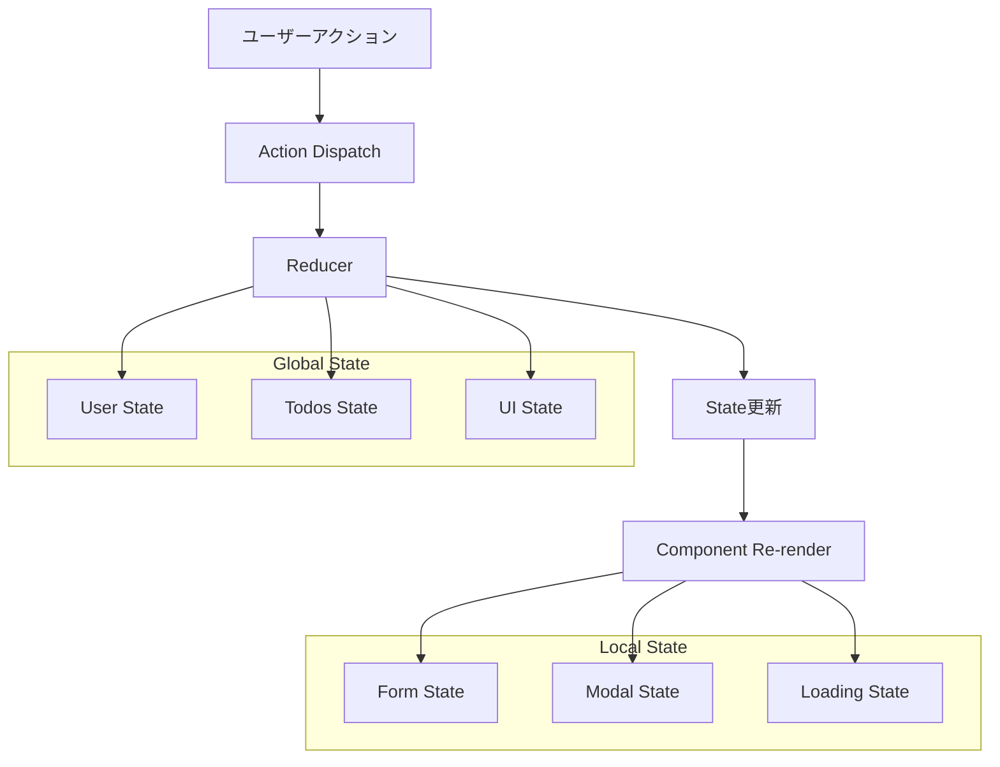

### Backend状態管理

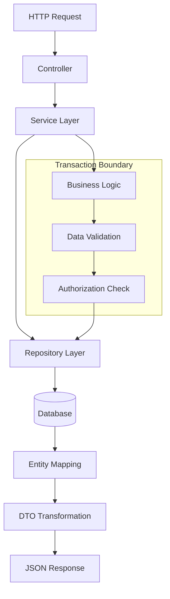

## パフォーマンス最適化フロー

### 1. キャッシュ戦略

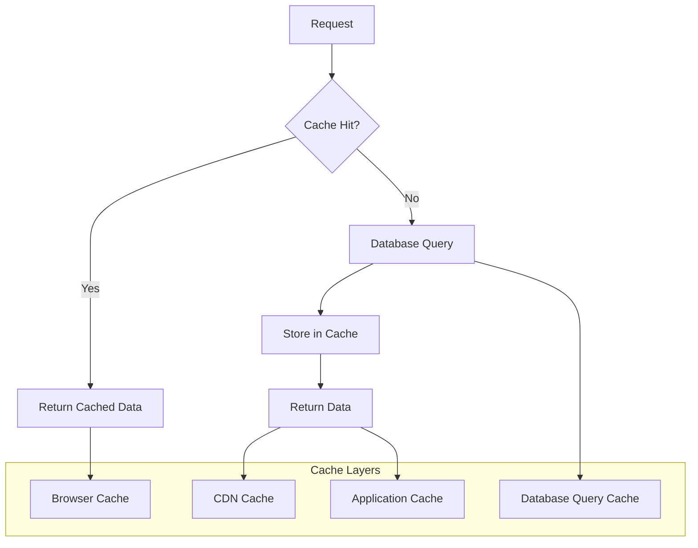

### 2. ページネーション戦略

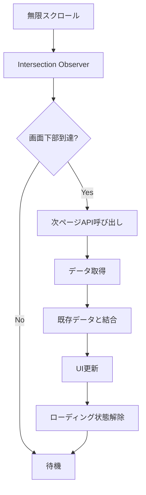

## セキュリティデータフロー

### JWT認証フロー

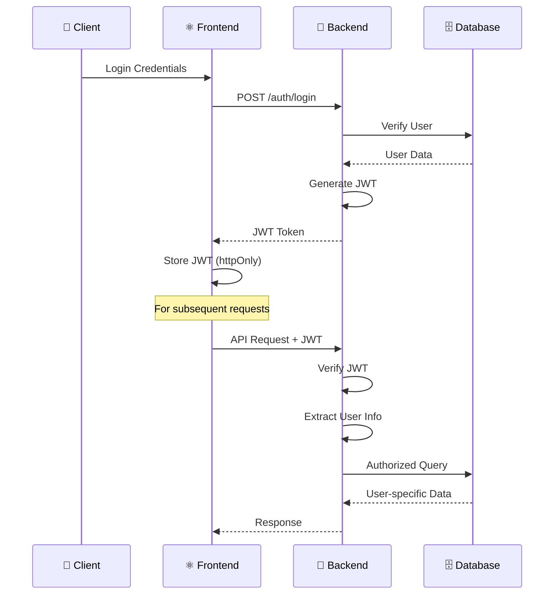